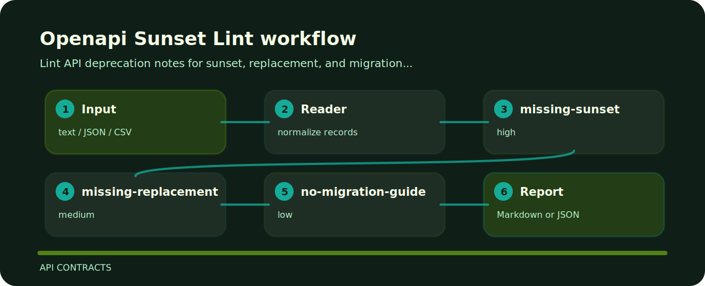

# Openapi Sunset Lint


## What it protects

Lint API deprecation notes for sunset, replacement, and migration gaps. It keeps the review small: one input file, a short list of findings, and enough context to fix the line that caused the warning.

## Run the sample

```bash
git clone https://github.com/mertefekurt/openapi-sunset-lint.git
cd openapi-sunset-lint
python -m pip install -e ".[dev]"
openapi-sunset-lint examples/sample.txt
```

## Signal route



## Signals

| Signal | Level | What it flags | Fix direction |
| --- | --- | --- | --- |
| `missing-sunset` | high | sunset date is missing | Add a clear removal date. |
| `missing-replacement` | medium | replacement endpoint is missing | Document the supported migration target. |
| `no-migration-guide` | low | migration guide is missing | Link a migration guide or compatibility notes. |

## Small safety pass

```bash
ruff check .
pytest
python -m openapi_sunset_lint --help
```
